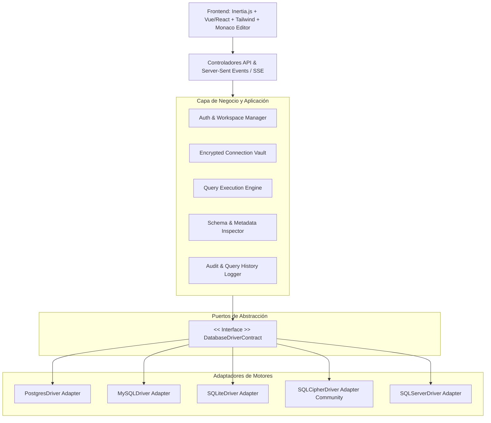
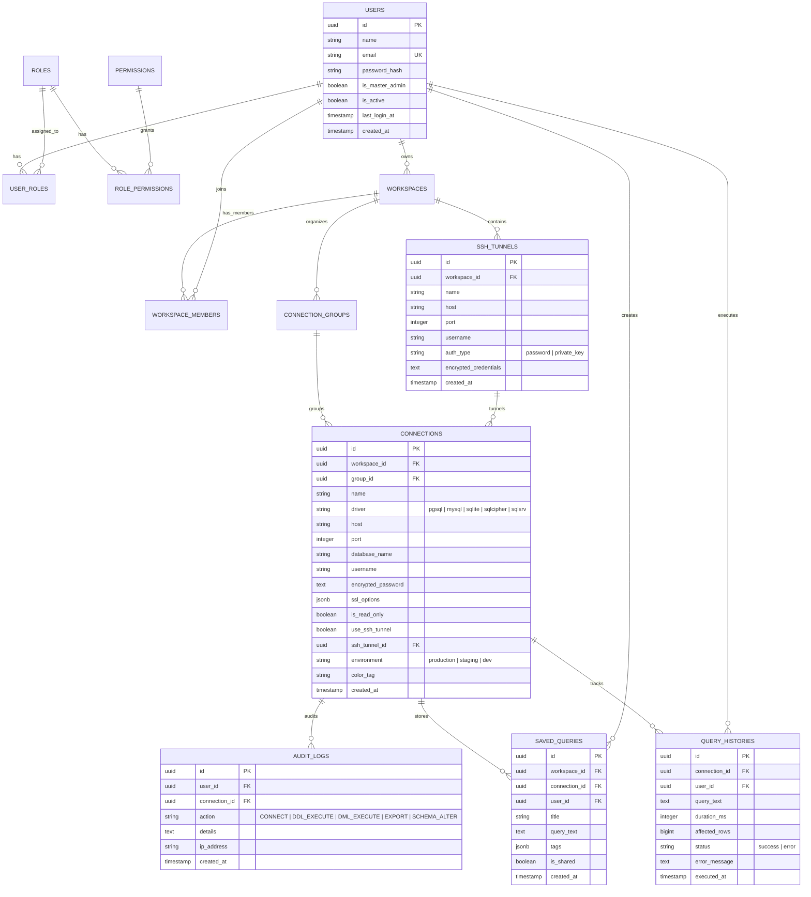

# Memoria Técnica y Arquitectura del Proyecto: SQL Client Web (Enterprise)

## 1. Visión y Alcance
Desarrollo de un cliente web completo para administración, monitoreo y análisis de bases de datos relacionales, al nivel de herramientas como Navicat, DBeaver o TablePlus, construido sobre **Laravel (PHP 8.3+)**.

### Motores de Base de Datos Soportados
1. **PostgreSQL** *(Prioridad Principal / Nivel 1)*:
   - Esquemas (`public`, personalizados, catálogos).
   - Tipos de datos nativos (JSONB, UUID, HStore, Arrays, Enums).
   - Funciones, Triggers, Vistas Materializadas y Secuencias.
   - Extensiones (`pg_trgm`, `postgis`, `pgcrypto`, etc.).
   - Visual EXPLAIN & ANALYZE con árboles de costos y tiempos.
2. **MySQL / MariaDB**:
   - Storage engines (InnoDB, MyISAM), Charsets y Collations.
   - Procedures, Functions, Triggers, Views.
3. **SQLite & SQLCipher (Community Edition)**:
   - Soporte para bases de datos locales en archivo y memoria.
   - **SQLCipher (Community Edition)**: Cifrado y descifrado transparente con clave/passphrase (PRAGMA key, PRAGMA cipher_compatibility, PRAGMA kdf_iter).
   - Modos WAL, Pragmas y chequeo de integridad.
4. **SQL Server y Motores Community**:
   - Arquitectura extensible por medio de Service Providers y adaptadores del `DatabaseDriverContract`.

---

## 2. Jerarquía y Segregación Multimotor y Multibase de Datos

El sistema implementa una **separación estricta por Motor y Sección**. No se mezclan conexiones ni bases de datos en un listado plano. Cada motor tiene su propio espacio de trabajo y cada servidor/instancia administra múltiples bases de datos de forma independiente y aislada:

```
🏢 [PANEL DE MOTORES Y SERVIDORES (Segregado por Secciones)]
├── 🐘 SECCIÓN POSTGRESQL
│   └── 🖥️ Servidor: PG_Produccion_Cluster (Host: 10.0.1.50)
│       ├── 🗄️ Base de Datos: 'crm_production'
│       │   ├── 📦 Esquema: 'public' (Tablas, Vistas, Funciones, Triggers)
│       │   ├── 📦 Esquema: 'billing' (Tablas, Vistas, Funciones)
│       │   └── 📦 Esquema: 'audit_log'
│       ├── 🗄️ Base de Datos: 'analytics_warehouse'
│       └── 🗄️ Base de Datos: 'identity_auth'
│
├── 🐬 SECCIÓN MYSQL / MARIADB
│   └── 🖥️ Servidor: MySQL_Master_Replication (Host: 192.168.1.10)
│       ├── 🗄️ Base de Datos: 'ecommerce_shop'
│       ├── 🗄️ Base de Datos: 'inventory_db'
│       └── 🗄️ Base de Datos: 'payments_gateway'
│
├── 🔒 SECCIÓN SQLCIPHER (Community Edition)
│   ├── 📁 Archivo Cifrado: 'wallet_secure_data.db' (AES-256)
│   └── 📁 Archivo Cifrado: 'offline_sync.db' (AES-256)
│
├── 🪶 SECCIÓN SQLITE (Local / Memory)
│   ├── 📁 Archivo: 'app_cache.sqlite'
│   └── 📁 Archivo: 'testing_fixtures.sqlite'
│
└── 🪟 SECCIÓN SQL SERVER / COMMUNITY
    └── 🖥️ Servidor: MSSQL_Enterprise_01 (Host: 10.0.2.20)
        ├── 🗄️ Base de Datos: 'ERP_Main'
        └── 🗄️ Base de Datos: 'HR_Payroll'
```

### Reglas de Contexto de Ejecución:
1. **Aislamiento de Sesión:** Cada pestaña (Tab) del editor SQL o Data Grid está anclada a una tupla inmutable de contexto: `(Server_ID, Database_Name, Schema_Name)`.
2. **Switching Rápido de Base de Datos:** Selector de base de datos activa por motor dentro del editor (`USE database` / `SET search_path TO ...` contextualizado).
3. **Segregación Visual en el Árbol:** Cada motor tiene su vista de árbol dedicada con capacidades específicas del motor (ej. PostgreSQL muestra *Extensions, Types y Schemas*, mientras que SQLite muestra *Pragmas y Vacuum*).

---

## 3. Flujo Metodológico de Trabajo
El proyecto sigue el estándar de calidad:
$$\text{Producto} \longrightarrow \text{Requisitos} \longrightarrow \text{Diseño} \longrightarrow \text{Backlog} \longrightarrow \text{Ticket} \longrightarrow \text{IA} \longrightarrow \text{Pruebas} \longrightarrow \text{Revisión} \longrightarrow \text{Git} \longrightarrow \text{Siguiente Ticket}$$

---

## 3. Arquitectura del Sistema (Hexagonal / Ports & Adapters)



---

## 4. Diagrama Entidad-Relación (DER) Interno



---

## 5. Módulo de Asistente de IA: Groq Cloud Dynamic Engine

El cliente incorpora un motor de asistencia de IA para acelerar el trabajo de bases de datos:

```
[Groq Cloud API: https://api.groq.com/openai/v1]
                   ▲
                   │ (GET /models - Auto-descubrimiento en tiempo real)
                   ▼
+-------------------------------------------------------------------------+
|                         GROQ AI SERVICE ENGINE                          |
|  - Dynamic Model Discovery (Lista automática sin modelos hardcodeados)  |
|  - Auto-Recommendation Engine (Recomienda el mejor modelo para SQL)     |
|  - Intelligent Cache (TTL 12h con botón de refresco manual)             |
+-------------------------------------------------------------------------+
       │                     │                     │
       ▼                     ▼                     ▼
[Text-to-SQL Generator] [Query Optimizer & EXPLAIN] [Error Fixer & Explain]
```

### Capacidades del Asistente IA:
1. **Descubrimiento Dinámico de Modelos:**
   - Consume automáticamente el endpoint `GET https://api.groq.com/openai/v1/models`.
   - **Cero modelos manuales/hardcodeados:** Si Groq agrega o retira modelos, la lista se actualiza automáticamente.
   - Algoritmo de recomendación inteligente: Evalúa el catálogo disponible y sugiere de forma predeterminada el modelo más óptimo para razonamiento SQL (ej. `llama-3.3-70b-versatile` o equivalentes activos).
2. **Ghost Text / Copilot Inline en Tiempo Real:**
   - Sugerencias inline transparentes (estilo Copilot) mientras el usuario escribe en el Monaco Editor (completa JOINs automáticos basados en FKs, condiciones WHERE y GROUP BY).
3. **Casos de Uso Integrados:**
   - **Text-to-SQL:** Genera consultas complejas a partir de lenguaje natural inyectando el DDL del esquema activo como contexto.
   - **Visual Query Builder con Generador SQL Bidireccional:** Diseñador visual donde el usuario arrastra tablas, tilda columnas, traza relaciones visuales (INNER/LEFT/RIGHT JOIN), define filtros y ordenamientos, generando el código SQL exacto en tiempo real y viceversa.
   - **Optimización y EXPLAIN:** Analiza cuellos de botella de índices y sugiere reescritura de queries para alto rendimiento.
   - **Auto-Fix de Errores:** Al recibir un error de sintaxis o tipo del motor (PostgreSQL/MySQL), un clic analiza el mensaje del motor y ofrece la corrección inmediata.
   - **Explicación de Esquemas:** Documenta y explica tablas, relaciones y procedimientos en lenguaje humano.

---

## 6. Sistema de Diseño, Microinteracciones y Barra de Herramientas

### A. Barra de Herramientas de Productividad (Acciones Rápidas)
- **Portapapeles Avanzado:**
  - Botones dedicados: `Copiar SQL`, `Copiar Fila Completa`, `Copiar como JSON`, `Copiar como CSV`, `Copiar como Sentencias INSERT`, `Cortar` y `Pegar`.
  - Toasts animados con feedback inmediato de copia exitosa.
- **Acciones de Formato y Control:**
  - `Formatear SQL (Prettify)`, `Minificar`, `Comentar/Descomentar Bloque`, `Limpiar Editor`, `Duplicar Línea`, `Buscar y Reemplazar Avanzado (Regex)`.

### B. Sistema de Animaciones Modernas & UI Motion
- **Stack de Animaciones:** Vue Transitions + Tailwind Transitions + Lucide Animated Icons.
- **Microinteracciones Clave:**
  - **Pestañas Fluidas:** Transición suave tipo deslizamiento al alternar tabs sin parpadeos de renderizado.
  - **Data Grid Highlights:** Animación de pulsación suave en verde/azul al actualizar o insertar celdas.
  - **Skeleton Loaders Pulidos:** Efecto de carga shimmer moderno mientras se resuelve la introspección de esquemas y queries pesadas.
  - **Sidebar Colapsable con Física de Acordeón:** Apertura y cierre elástico y suave de esquemas y árboles de objetos.
  - **Modales con Efecto Glassmorphism / Blur:** Fondos semitransparentes con desenfoque de fondo y animación de escala.

---

## 7. Módulos y Estructura del Sistema

- **Ticket #1:** Inicialización del proyecto Laravel, configuración de estándares (PHPStan, Pint, Pest), base de datos interna y migraciones core (Users, Roles, Workspaces, Connections, SSH Tunnels).
- **Ticket #2:** Bóveda de Autenticación Maestra (Login, RBAC y Encriptación Envelope AES-256 de credenciales).
- **Ticket #3:** Arquitectura del `DatabaseDriverContract` e Implementación Completa del Driver **PostgreSQL**.
- **Ticket #4:** Implementación de Drivers secundarios (MySQL y SQLite).
- **Ticket #5:** Servicio de Inspector de Esquemas (Árbol de objetos: Schemas, Tables, Columns, Constraints, Indexes).
- **Ticket #6:** Motor de Ejecución de Consultas con Paginación de Cursores y Streaming SSE.
- **Ticket #7:** Editor SQL Avanzado (Monaco Editor, Auto-completado de esquema, Multi-tab, EXPLAIN ANALYZE visual).
- **Ticket #8:** Data Grid interactivo con Edición Inline y DDL Generator.
- **Ticket #9:** Diseñador Visual de Diagramas ERD y Módulo de Export/Import.
- **Ticket #10:** Historial de Consultas, Snippets y Registro de Auditoría.
